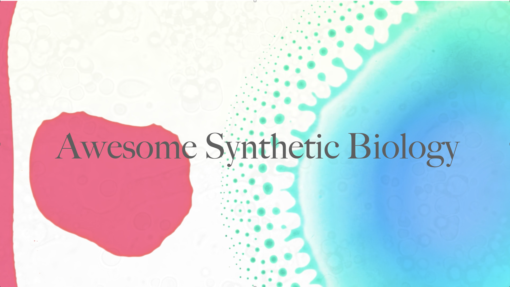

 <h1 align="center">Awesome Synthetic Biology</h1>
  

    
  

  
📖 A curated list of resources dedicated to Synthetic Biology

  
Please check the <a href="CONTRIBUTING.md">contribution guidelines</a> for information on formatting and writing pull requests.

## Basics

If you are new to Biology, you might want to start with the following resources:

### Concepts of Biology

- [Chapter 9: Introduction to Molecular Biology](https://opentextbc.ca/biology/part/introduction-to-molecular-biology/)
- [Chapter 9.1: The Structure of DNA](https://opentextbc.ca/biology/chapter/9-1-the-structure-of-dna/)
- [Chapter 9.2: DNA Replication](https://opentextbc.ca/biology/chapter/9-2-dna-replication/)
- [Chapter 9.3: Transcription](https://opentextbc.ca/biology/chapter/9-3-transcription/)
- [Chapter 9.4: Translation](https://opentextbc.ca/biology/chapter/9-4-translation/)
- [Chapter 9.5: How Genes Are Regulated](https://opentextbc.ca/biology/chapter/9-5-how-genes-are-regulated/)

- [Chapter 10: Introduction to Biotechnology](https://opentextbc.ca/biology/part/introduction-to-biotechnology/)
- [Chapter 10.1: Cloning and Genetic Engineering](https://opentextbc.ca/biology/chapter/10-1-cloning-and-genetic-engineering/)
- [Chapter 10.2: Biotechnology in Medicine and Agriculture](https://opentextbc.ca/biology/chapter/10-2-biotechnology-in-medicine-and-agriculture/)
- [Chapter 10.3: Genomics and Proteomics](https://opentextbc.ca/biology/chapter/10-3-genomics-and-proteomics/)

### Addgene Blog

- [Addgene - Molecular Biology Reference](https://www.addgene.org/mol-bio-reference/)
- [Addgene - Plasmids: Simplified](https://blog.addgene.org/plasmids-simplified)
- [Addgene - Plasmids 101](https://cdn2.hubspot.net/hubfs/306096/Plasmids%20101%203rd%20Edition/2020_04_27_plasmids1013rdEditionSemifinal_2018%20Links%20Update.pdf?hsCtaTracking=d068532b-546d-4170-af8b-827fbd0e7325%7C9c4aeb14-a164-4736-829e-048f070d6576)
- [Addgene - The Promoter Region](https://blog.addgene.org/plasmids-101-the-promoter-region)
- [Addgene - Terminators and PolyA signals](https://blog.addgene.org/plasmids-101-terminators-and-polya-signals)
- [Addgene - Inducible Promoters](https://blog.addgene.org/plasmids-101-inducible-promoters)
- [Addgene - Repressible Promoters](https://blog.addgene.org/plasmids-101-repressible-promoters)
- [Addgene - Positive and Negative Selection](https://blog.addgene.org/plasmids-101-positive-and-negative-selection-for-plasmid-cloning)
- [Addgene - Transformation, Transduction, Bacterial Conjugation, and Transfection](https://blog.addgene.org/plasmids-101-transformation-transduction-bacterial-conjugation-and-transfection)
- [Addgene - Origin of Replication](https://blog.addgene.org/plasmid-101-origin-of-replication)
- [Addgene - Antibiotic Resistance Genes](https://blog.addgene.org/plasmids-101-everything-you-need-to-know-about-antibiotic-resistance-genes)
- [Addgene - Blue/White Selection](https://blog.addgene.org/plasmids-101-blue-white-screening)
- [Addgene - Protein Expression](https://blog.addgene.org/plasmids-101-protein-expression)
- [Addgene - E. Coli Strains for Protein Expression](https://blog.addgene.org/plasmids-101-e-coli-strains-for-protein-expression)
- [Addgene - Common Lab E. Coli Strains](https://blog.addgene.org/plasmids-101-common-lab-e-coli-strains)
- [Addgene - Plasmid Incompatibility](https://blog.addgene.org/plasmids-101-plasmid-incompatibility)
- [Addgene - Multicistronic Vectors](https://blog.addgene.org/plasmids-101-multicistronic-vectors)
- [Addgene - Protein Tags](https://blog.addgene.org/plasmids-101-protein-tags)
- [Addgene - Methylation and Restriction Enzymes](https://blog.addgene.org/plasmids-101-methylation-and-restriction-enzymes)

### Procedure Reviews:
- [Addgene - Restriction Cloning](https://blog.addgene.org/plasmids-101-restriction-cloning)
- [Addgene - Gibson Assembly and Other Long-Homology Based Cloning Methods](https://blog.addgene.org/plasmids-101-gibson-assembly)
- [Addgene - How to Verify Your Plasmid](https://blog.addgene.org/plasmids-101-how-to-verify-your-plasmid)
- [Addgene - Optimizing Plasmid Yields](https://blog.addgene.org/optimizing-plasmids-101-plasmid-yields)
- [Khan Academy Medicine - Gel Electrophoresis](https://youtu.be/mN5IvS96wNk)
- [Addgene - Gel Electrophoresis](https://www.addgene.org/protocols/gel-electrophoresis/)
- [Addgene - Streak Plate](https://www.addgene.org/protocols/streak-plate/)
- [Addgene - Restriction Digest](https://www.addgene.org/protocols/restriction-digest/)
- [Addgene - Plating Antibiotic over Agar](https://www.addgene.org/protocols/over-agar-antibiotic-plating/)
- [Addgene - Pouring Agar Plates](https://www.addgene.org/protocols/pouring-lb-agar-plates/)
- [Addgene - Bacterial Transformation](https://www.addgene.org/protocols/bacterial-transformation/)
- [Addgene - Primer Design](https://www.addgene.org/protocols/primer-design/)
- [Addgene - PCR](https://www.addgene.org/protocols/pcr/)
- [Addgene - Gel Electrophoresis](https://www.addgene.org/protocols/gel-electrophoresis/)

### Bioinformatics, R&D tools & Learning

- Benchling - sign up for an account with your JHU (@jhu.edu, NOT @jh.edu) email, join the JHU iGEM team
  - [Benchling](https://benchling.com)
  - [Benchling Tutorials](https://benchling.com/tutorials)
- NCBI BLAST (Basic Local Alignment Search Tool)
  - [NCBI Blast (Old) Tutorial](https://www.youtube.com/watch?v=HXEpBnUbAMo) (OLD tutorial)
  - [NCBI BLAST](https://blast.ncbi.nlm.nih.gov/Blast.cgi)
- NCBI RefSeq and PDB
  - [NCBI Minute: A Beginner's Guide to Genes and Sequences at NCBI](https://www.youtube.com/watch?v=QIZ8QH6JcC8) (tutorial)
  - [NCBI](https://www.ncbi.nlm.nih.gov/)

- [Coursera - Data Science](https://www.coursera.org/programs/coursera-for-johns-hopkins-university-zfk78?authProvider=jhu&collectionId=&currentTab=CATALOG&productId=Q7ft0KTtEeWVehLHxyUMyQ&productType=s12n&showMiniModal=true) - Sign up with your @jhu.edu email to get free course certificates. Do this course first.
- [Coursera - Genomic Data Science](https://www.coursera.org/programs/coursera-for-johns-hopkins-university-zfk78?authProvider=jhu&collectionId=&currentTab=CATALOG&productId=RBLtOqjrEeWKzg6na9raqQ&productType=s12n&showMiniModal=true) - Sign up with your @jhu.edu email to get free course certificates. Do this course second.
- [OpenWetWare - Digital Tools and Resources](https://openwetware.org/wiki/Digital_Tools_&_Resources) - A comprehensive list of all tools you may ever need.

## Publications

- [Biorxiv synbio feed for latest publications](https://www.biorxiv.org/collection/synthetic-biology)

## Courses

- [Compsynbioclass.org](https://www.compsynbioclass.org/): is the course website for Boston University's "Computational Synthetic Biology for Engineers". Website features complete lecture slide decks, reading assingments and open-sourced project repos.
- [Waag's BioHackAcadamy](http://biohackacademy.github.io/): This is the central Syllabus of the BioHack Academy 2023.

## Facilitating access to DNA sequences

- [Addgene](https://www.addgene.org/): is a nonprofit plasmid repository that archives and distributes high quality plasmids.
- [Stanford Free Genes Project](https://stanford.freegenes.org/): Contribute ideas for useful DNA sequences to be developed for an open biotechnology commons. The Stanford Free Genes Project will synthesize these sequences and distribute them under the OpenMTA, allowing for the development of applications that benefit humanity and the environment.

## Standards
- [SBOL](https://sbolstandard.org/): Standard interchange format to exchange information between design tools and scientists.
- [SBML](http://sbml.org/): Standards to describe mathematical models for biological systems. 

## Programming Languages

- [Cello](https://www.cidarlab.org/cello): Cello is a framework that describes what is essentially a programming language to design computational circuits in living cells. The circuits generated on plasmids expressed in Escherichia coli required careful insulation from their genetic context, but primarily functioned as specified. The circuits could, for example, regulate cellular functions in response to multiple environmental signals. Such a strategy can facilitate the development of more complex circuits by genetic engineering.
- [Eugene](https://www.cidarlab.org/eugene): Eugene is a human- and machine-readable language for specifying the design of biological systems. It allows users to generate biological designs based on customizable constraints, such as the maximum number of included genetic parts, the directionality of specific components, or the total sequence length of the output device.

## Misc Tools

- [3DuF](https://www.cidarlab.org/3duf): 3DuF is an interactive design tool for engineering continuous flow microfluidics. 3DuF is an open-source design tool that incorporates features from both traditional CAD tools like Autodesk and Solidworks and PCB design tools to accelerate the design flow.
- [Beholder](https://www.cidarlab.org/beholder): Beholder is a Python end-to-end tool, microscopy image, and data analysis tool for biophysicists and synthetic biologists. With Beholder, researchers and microscope users can automatically obtain fluorescence measurements of a population of cells (at the single-cell level) for multiple experiments from their ND2 files.
- [Clotho](https://www.cidarlab.org/clotho): Clotho is a framework for engineering synthetic biological systems and managing the data used to create them. It serves as both a centralized location to store synthetic biological information — such as genetic parts, nucleic acid sequences, and physical samples– as well as a framework for applications (apps) which interact with said data.
- [Constellation](https://www.cidarlab.org/constellation): Enumerate genetic designs through graphs that are mathematically rigorous.
- [DAFD](https://www.cidarlab.org/dafd): DAFD is the first microfluidic design automation software that can deliver a user-specified desired performance using machine learning.
- [Double Dutch](https://www.cidarlab.org/double-dutch): Double Dutch is a tool for designing combinatorial libraries of biological systems based on designs from response surface methodology (RSM).
- [Fluigi](https://www.cidarlab.org/fluigi): Fluigi is a Computer Aided Design (CAD) framework for creating microfluidic devices for use in synthetic biology. These devices are designed to help overcome the size and complexity limitations of conventional, intracellular genetic circuit designs by physically separating circuit components and precisely controlling the flow of fluid between them.
- [FPselection](https://www.cidarlab.org/fpselection): Algorithms for fluorophore selection.
- [Hummingbird](https://www.cidarlab.org/hummingbird): Hummingbird is a repository of MoClo DNA part and plasmid libraries developed by the CIDAR lab.
- [Knox](https://www.cidarlab.org/knox): Knox is a web-enabled repository for storing, modifying, and tracking changes to genetic design spaces encoding thousands of genetic design variants as directed graphs. Graph edges are labeled with sets of IDs for genetic parts such as promoters, coding sequences, and terminators. Each path from a start node to a stop node represents a combinatorial set of designs formed by concatenating one part from each edge in the path.
- [Merlin](https://www.cidarlab.org/merlin): Merlin is a web-based application for genomic reprogramming via a rapid and efficient method known as Multiplex Automated Genome Engineering (MAGE). This process can be used to target many regions on a genome simultaneously, in order to construct highly modified organisms, or to create diverse populations and explore a large genome landscape.
- [Neptune](https://www.cidarlab.org/neptune): Neptune is a complete, end-to-end microfluidic design suite for synthetic biologists. With Neptune, researchers and microfluidic designers have all the tools needed to design, fabricate, and control microfluidic devices. Neptune supports high level specification of the layout and function of a microfluidic chip.
- [Owl](https://www.cidarlab.org/owl): Owl is a tool that allows users to create electronic datasheets for new biological parts, devices, or systems. Users can enter their data into preexisting fields for a given data model and add their own data from assays. Or users can search from existing webpages on the Registry of Standard Biological Parts (parts.igem.org) and produce datasheets in a consistent format.
- [Oriole](https://www.cidarlab.org/oriole): Oriole is a synthetic biology design tool that divides a biological network into implementable sub-networks, when given a set of engineering constraints. It allows users to convert a biological network, such as a gene regulatory network, metabolic network or species interaction network, into its graphical representation, and be divided into a set of sub-networks with user-defined objectives and constraints. Such sub-networks can be engineered experimentally to communicate and carry out distributed functions.
- [Phagebook](https://www.cidarlab.org/phagebook): Phagebook is a Clotho 3.0 app that serves as a social networking interface incorporating lab inventory management and project/personnel networking. Phagebook facilitates collaboration amongst the synthetic biology community and like any other Clotho app, it directly communicates with Clotho apps for specification, design, assembly, and verification of synthetic biological systems.
- [Phoenix](https://www.cidarlab.org/phoenix): The Phoenix project describes a framework to design complex genetic systems where the focus is on how the system behaves over time instead of its behavior at steady-state. Using Signal Temporal Logic (STL) -- a formalism used to specify properties of dense-time real-valued signals, biologists can specify very precise temporal behaviors of a genetic system.
- [Pigeon](https://www.cidarlab.org/pigeon): Pigeon is a Web-based tool that translates a textual description of a synthetic biology design into an image. It allows programmatic generation of design visualizations, is easy to learn, is easily extensible to new glyphs and notation, and can be connected to other software tools for visualizing their output.
- [Puppeteer](https://www.cidarlab.org/puppeteer): Puppeteer is a web-based planning and instruction generation tool which automates the task of DNA assembly by tracking, managing, and controlling laboratory tasks, reagents, and equipment. It is designed to translate protocols into sets of human- and machine-readable instructions, reducing the labor cost of building genetic devices.
- [Raven](https://www.cidarlab.org/raven): Raven is a DNA assembly planning tool that generates optimized assembly plans that minimize both the labor and reagent cost involved in constructing target DNA sequences from oligo- and plasmid-derived fragments. Raven is faster and more reliable than designing assembly plans by hand, freeing synthetic biologists from much of the effort and human-error involved in manual assembly planning.
- [Guide tool](https://www.cidarlab.org/copy-of-knox): Guide tool is a software that can give a valve-based solution for user to control their biochip according to their operation descriptions and biochip design file generated from 3DuF. Besides, user can also use one of the outputs from Guide tool to do experiments on Biochip by hardware without manual intervention.
- [MINT](https://www.cidarlab.org/copy-of-3duf): MINT is a netlist description language used for describing parametric microfluidic device designs. MINT features a human-readable grammar that can be compiled by the MINT compiler. MINT additionally allows the user to capture user-defined layout constraints that can be optionally be processed by physical design algorithms.
- [Bioperl](https://bioperl.org/): The Bioperl Project is an international association of users & developers of open source Perl tools for bioinformatics, genomics and life science.
- [(Poly)merase](https://github.com/bebop/poly): Poly is a Go package for engineering organisms.
- [Ark](https://github.com/bebop/ark): Go REST API to replace Genbank, Uniprot, Rhea, and CHEMBL.
- [GENtle2](https://github.com/Synbiota/GENtle2): Web-Based DNA Editor for Synthetic Biology.
- [Gigabase](http://derk-jan.me/programming-life/): Brogramming for life: Gigabase is your virtual cell. Give it infrastructure, give it metabolites. Add metabolism and protein synthesis. Finally design some DNA and some transporters. Press simulate and see how the metabolites are transpoterd, consumed and converted, while the other compounds are produced and synthesized. One day the virutal cell will turn design into real biological computers.
- [BioHackAcademy](https://github.com/biohackacademy): Open Source #DIYBio Lab equipment.
- [libSBOLj](https://github.com/SynBioDex/libSBOLj): Java Library for Synthetic Biology Open Language (SBOL).

## Applications

- [Biosensors](https://en.wikipedia.org/wiki/Synthetic_biology#Biosensors)
- [Food and drink](https://en.wikipedia.org/wiki/Synthetic_biology#Food_and_drink)
- [Materials](https://en.wikipedia.org/wiki/Synthetic_biology#Materials)
- [Biological computers](https://en.wikipedia.org/wiki/Synthetic_biology#Biological_computers)
- [Cell transformation](https://en.wikipedia.org/wiki/Synthetic_biology#Cell_transformation)
- [Designed proteins](https://en.wikipedia.org/wiki/Synthetic_biology#Designed_proteins)
- [Designed nucleic acid systems](https://en.wikipedia.org/wiki/Synthetic_biology#Designed_nucleic_acid_systems)
- [Space exploration](https://en.wikipedia.org/wiki/Synthetic_biology#Space_exploration)
- [Synthetic life](https://en.wikipedia.org/wiki/Synthetic_biology#Synthetic_life)
- [Drug delivery platforms](https://en.wikipedia.org/wiki/Synthetic_biology#Drug_delivery_platforms)
    - [Engineered bacteria-based platform](https://en.wikipedia.org/wiki/Synthetic_biology#Engineered_bacteria-based_platform)
    - [Cell-based platform](https://en.wikipedia.org/wiki/Synthetic_biology#Cell-based_platform)
- [Biofuels, pharmaceuticals and biomaterials](https://en.wikipedia.org/wiki/Synthetic_biology#Biofuels,_pharmaceuticals_and_biomaterials)
- [CRISPR/Cas9](https://en.wikipedia.org/wiki/Synthetic_biology#CRISPR/Cas9)
- [Regulatory elements](https://en.wikipedia.org/wiki/Synthetic_biology#Regulatory_elements)
- [Organoids](https://en.wikipedia.org/wiki/Synthetic_biology#Organoids)
- [Bioprinted organs](https://en.wikipedia.org/wiki/Synthetic_biology#Bioprinted_organs)
- [Other transplants and induced regeneration](https://en.wikipedia.org/wiki/Synthetic_biology#Other_transplants_and_induced_regeneration)
- [Nanoparticles, artificial cells and micro-droplets](https://en.wikipedia.org/wiki/Synthetic_biology#Nanoparticles,_artificial_cells_and_micro-droplets)
- [Electrogenetics](https://en.wikipedia.org/wiki/Synthetic_biology#Electrogenetics)
- [Agriculture](https://golden.com/wiki/Synthetic_biology-8AR8ZAX#Cellular-agriculture)
- [Pest control](https://golden.com/wiki/Synthetic_biology-8AR8ZAX#Biological-pest-control-with-genetically-engineered-organisms)
- [Aquaculture](https://golden.com/wiki/Synthetic_biology-8AR8ZAX#Aquaculture)
- [Bioplastic](https://golden.com/wiki/Synthetic_biology-8AR8ZAX#Bioplastic)
- [Xenotransplantation](https://golden.com/wiki/Synthetic_biology-8AR8ZAX#Xenotransplantation)
- [Biomanufacturing](https://golden.com/wiki/Synthetic_biology-8AR8ZAX#Biomanufacturing)
- [Carbon capture and conversion](https://golden.com/wiki/Synthetic_biology-8AR8ZAX#Carbon-capture-and-conversion)
- [Biomining](https://golden.com/wiki/Synthetic_biology-8AR8ZAX#Biomining)

## License

This work is licensed under a [Creative Commons Attribution 4.0 International License](http://creativecommons.org/licenses/by/4.0/).